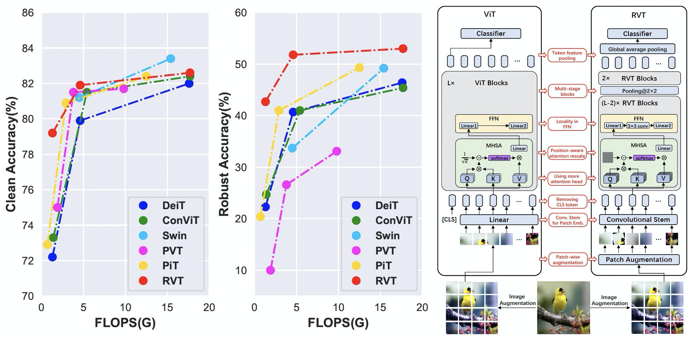

# RVT: Towards Robust Vision Transformer


### News: We add adversarial training result of RVT [here](https://github.com/alibaba/easyrobust/tree/main/RVT#adversarially-trained-weights) !!


This repository contains PyTorch code for Robust Vision Transformers in CVPR2022.

***Note: Since the model is trained on our private platform, this transferred code has not been tested and may have some bugs. If you meet any problems, feel free to open an issue!***



For details see our paper "Towards Robust Vision Transformer"

# Usage

First, clone the repository locally:
```
git clone https://github.com/alibaba/easyrobust.git
cd easyrobust/RVT
```
Install PyTorch 1.7.0+ and torchvision 0.8.1+ and [pytorch-image-models 0.3.2](https://github.com/rwightman/pytorch-image-models):

```
conda install -c pytorch pytorch torchvision
pip install timm==0.3.2
```
In addition, `einops` and `kornia` is required for using this implementation:
```
pip install einops
pip install kornia
```

We use 4 nodes with 8 gpus to train `RVT-Ti`, `RVT-S` and `RVT-B`:
## Training
### RVT-Ti:
```
python -m torch.distributed.launch --nproc_per_node=8 --nnodes=4 main.py --model rvt_tiny --data-path /path/to/imagenet --output_dir output --dist-eval
```
### RVT-S:
```
python -m torch.distributed.launch --nproc_per_node=8 --nnodes=4 main.py --model rvt_small --data-path /path/to/imagenet --output_dir output --dist-eval
```
### RVT-B:
```
python -m torch.distributed.launch --nproc_per_node=8 --nnodes=4 main.py --model rvt_base --data-path /path/to/imagenet --output_dir output --batch-size 32 --dist-eval
```
You can also finetune the pretrained model by adding `--pretrained`.

If you want to train `RVT-Ti*`, `RVT-S*` or `RVT-B*`, simply specify `--model` as `rvt_tiny_plus`, `rvt_small_plus` or `rvt_base_plus`, then add `--use_patch_aug` to enable patch-wise augmentation.

## Testing

***News: The robustness evaluation now is supported!! Because of the environmental differences, the results of robustness may have the fluctuations of ±0.1~0.3% compared with paper results.***

### RVT-Ti:
```
python main.py --eval --pretrained --model rvt_tiny --data-path /path/to/imagenet
```
### RVT-Ti*:
```
python main.py --eval --pretrained --model rvt_tiny_plus --data-path /path/to/imagenet
```
### RVT-S:
```
python main.py --eval --pretrained --model rvt_small --data-path /path/to/imagenet
```
### RVT-S*:
```
python main.py --eval --pretrained --model rvt_small_plus --data-path /path/to/imagenet
```
### RVT-B:
```
python main.py --eval --pretrained --model rvt_base --data-path /path/to/imagenet
```
### RVT-B*:
```
python main.py --eval --pretrained --model rvt_base_plus --data-path /path/to/imagenet
```

To enable robustness evaluation, please add one of `--inc_path /path/to/imagenet-c`, `--ina_path /path/to/imagenet-a`, `--inr_path /path/to/imagenet-r` or `--insk_path /path/to/imagenet-sketch` to test [ImageNet-C](https://github.com/hendrycks/robustness), [ImageNet-A](https://github.com/hendrycks/natural-adv-examples), [ImageNet-R](https://github.com/hendrycks/imagenet-r) or [ImageNet-Sketch](https://github.com/HaohanWang/ImageNet-Sketch).

If you want to test the accuracy under adversarial attackers, please add `--fgsm_test` or `--pgd_test`.

# Pretrained weights

| Model name   |  FLOPs  | accuracy  | weights |
|:-------:|:--------:|:--------:|:--------:|
| `rvt_tiny` |  1.3 G | 78.4 | [link](https://drive.google.com/file/d/1L500fTe3MRNSfrd3bjfbMDk0M11D-bZR/view?usp=sharing) |
| `rvt_small` |  4.7 G | 81.7 | [link](https://drive.google.com/file/d/1YW19LnWNZnx5tn0x-z-4Oypb4ZGD4QYr/view?usp=sharing) |
| `rvt_base` |  17.7 G | 83.4 | [link](https://drive.google.com/file/d/134cHKCAz_IJ91G5fvqNCZBjZ9Z62YQDm/view?usp=sharing) |
| | | | |
| `rvt_tiny*` | 1.3 G | 79.3 | [link](https://drive.google.com/file/d/1zKq6_WT2Y4eHHSARmdU-CkA3rttysPd7/view?usp=sharing) |
| `rvt_small*` | 4.7 G | 81.8 | [link](https://drive.google.com/file/d/1g40huqDVthjS2H5sQV3ppcfcWEzn9ekv/view?usp=sharing) |
| `rvt_base*` | 17.7 G | 83.6 | [link](https://drive.google.com/file/d/13pEjHNij9YPjCyI7_sOAVQ7FfFgWaC5W/view?usp=sharing) |

# Adversarially trained weights

| Model name   |  clean accuracy  | PGD accuracy  | weights |
|:-------:|:--------:|:--------:|:--------:|
| `adv_deit_tiny` |  52.05 | 26.55 | [link](https://drive.google.com/file/d/11In1SXM_SmDO2OqgabGlkZ4jacjGuPlV/view?usp=sharing) |
| `adv_rvt_tiny` |  54.91 | 28.1 | [link](https://drive.google.com/file/d/1FdtGl1nNHmt3q_zVLobRNS-KxMmhgFmy/view?usp=sharing) |

To test these models, run following commands:

```
python adv_test.py --model deit_tiny_patch16_224 --ckpt_path adv_deit_tiny.pth
```

```
python adv_test.py --model rvt_tiny --ckpt_path adv_rvt_tiny.pth
```
