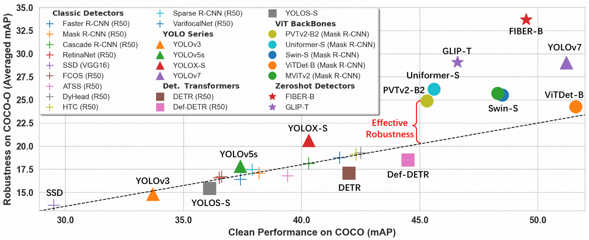
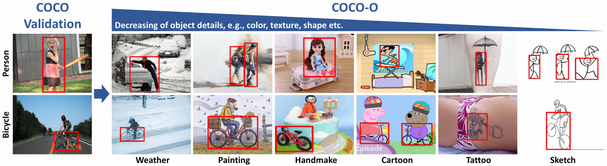

# COCO-O: A Benchmark for Object Detectors under Natural Distribution Shifts (ICCV'2023)



This repository contains the data and guidelines of COCO-O dataset, which is proposed in our ICCV2023 paper "COCO-O: A Benchmark for Object Detectors under Natural Distribution Shifts".

Paper: https://arxiv.org/abs/2307.12730

## COCO-O

COCO-O(ut-of-distribution) contains 6 domains (sketch, cartoon, painting, weather, handmake, tattoo) of COCO objects which are hard to be detected by most existing detectors. The dataset has a total of 6,782 images and 26,624 labelled bounding boxes.

If you want to use our COCO-O, first [download dataset from here](https://drive.google.com/file/d/1aBfIJN0zo_i80Hv4p7Ch7M8pRzO37qbq/view?usp=drive_link) and then unzip the `ood_coco.zip` into `/path/to/ood_coco`

After that, you can follow the section of [Benchmarking Detectors](#benchmarking-detectors) to evaluate on coco-o.



## Benchmarking Detectors 

COCO-O is organized with a similar file structure with COCO validation. So the standard COCO evaluation protocol works consistently by changing the directory `/path/to/coco` to `/path/to/ood_coco/sketch`

**COCO Validation**
```
coco
|-- val2017
    |-- xxx.jpg
    |-- ...
|-- annotations
    |-- instances_val2017.json
```

**COCO-O**
```
coco-o
|-- sketch
    |-- val2017
        |-- xxx.jpg
        |-- ...
    |-- annotations
        |-- instances_val2017.json
|-- cartoon
    |-- val2017
        |-- xxx.jpg
        |-- ...
    |-- annotations
        |-- instances_val2017.json
|-- painting
    ...
```

Following is the example for using COCO-O in [MMdetection](https://github.com/open-mmlab/mmdetection) or [Detectron2](https://github.com/facebookresearch/detectron2)

### MMDetection

```bash
git clone https://github.com/open-mmlab/mmdetection.git
cd mmdetection
mkdir data
ln -s /path/to/ood_coco/sketch data/coco

python tools/test.py ${CONFIG_FILE} ${CHECKPOINT_FILE} --eval bbox
```

### Detectron2

```bash
git clone https://github.com/facebookresearch/detectron2.git
cd detectron2
mkdir datasets
ln -s /path/to/ood_coco/sketch datasets/coco

./tools/lazyconfig_train_net.py --config-file ${CONFIG_FILE} \
train.init_checkpoint=${CHECKPOINT_FILE} \
--eval-only
```

## Citation

If you find this useful in your research, please consider citing:

    @article{mao2023coco,
      title={COCO-O: A Benchmark for Object Detectors under Natural Distribution Shifts},
      author={Mao, Xiaofeng and Chen, Yuefeng and Zhu, Yao and Chen, Da and Su, Hang and Zhang, Rong and Xue, Hui},
      journal={Proceedings of the IEEE/CVF International Conference on Computer Vision},
      year={2023}
    }