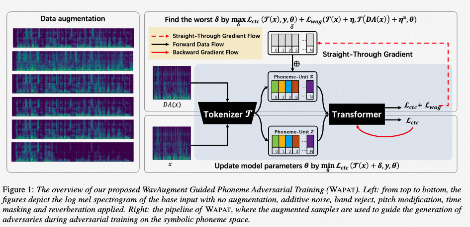

# Robust Automatic Speech Recognition via WavAugment Guided Phoneme Adversarial Training
This is the official PyTorch implementation of [WAPAT (Interspeech2023)](https://arxiv.org/pdf/2307.12498.pdf)
>**Abstract:** Developing a practically-robust automatic speech recognition (ASR) is challenging since the model should not only maintain the original performance on clean samples, but also achieve consistent efficacy under small volume perturbations and large domain shifts. To address this problem, we propose a novel WavAugment Guided Phoneme Adversarial Training (WAPAT). WAPAT use adversarial examples in phoneme space as augmentation to make the model invariant to minor fluctuations in phoneme representation and preserve the performance on clean samples. In addition, WAPAT utilizes the phoneme representation of augmented samples to guide the generation of adversaries, which helps to find more stable and diverse gradient-directions, resulting in improved generalization. Extensive experiments demonstrate the effectiveness of WAPAT on End-to-end Speech Challenge Benchmark (ESB). Notably, SpeechLM-WAPAT outperforms the original model by 6.28% WER reduction on ESB, achieving the new state-of-the-art.



## Dependencies
Follow [SpeechLM](https://github.com/microsoft/SpeechT5/tree/main/SpeechLM) to prepare the environments.

## Setup
To train models, please follow the instructions below.
```bash
git submodule update --init SpeechLM/fairseq
cd SpeechLM/
pip install --editable fairseq/
pip install sacrebleu==1.5.1
```

## Run 
```
model_path=path/to/your/pre-trained/model
data_dir=dataset/LibriSpeech/asr
bash speechlm/scripts/tune_speechlm_asr/finetune_base_ctc.sh $model_path $data_dir
```

## Acknowledgements
This implementation uses parts of the code from the following Github repos:
[SpeechT5](https://github.com/microsoft/SpeechT5)
as described in our code.

## Citation

If you find our work and this repository useful. Please consider giving a star ⭐ and citation.

```
@article{qi2023wapat,
  title={Robust Automatic Speech Recognition via WavAugment Guided Phoneme Adversarial Training},
  author={Gege Qi, Yuefeng Chen, Xiaofeng Mao, Xiaojun Jia, Ranjie Duan, Rong Zhang, Hui Xue},
  booktitle={INTERSPEECH 2023: Conference of the International Speech Communication Association.},
  year={2023}
}