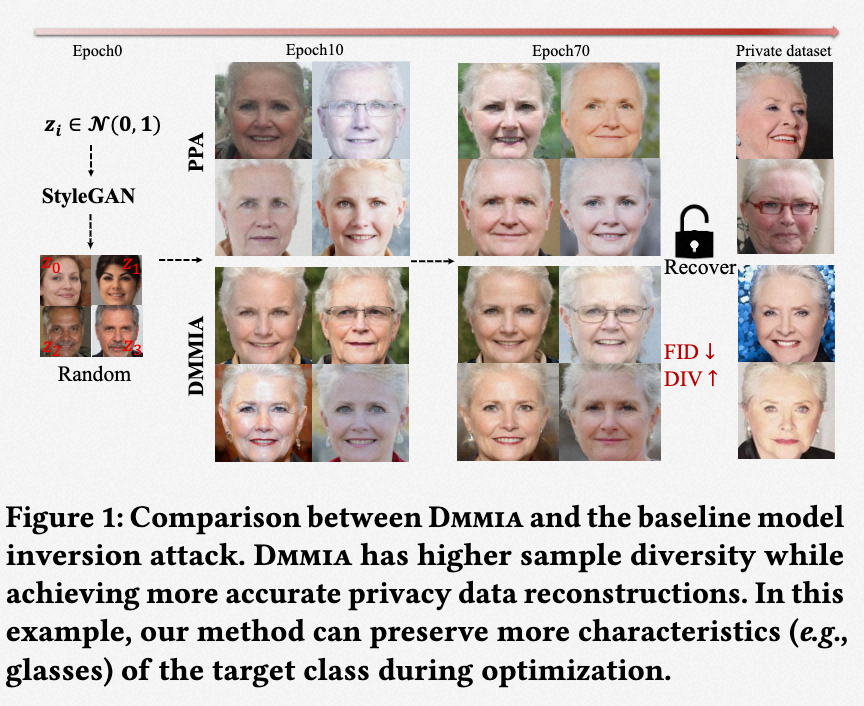

# Model Inversion Attack via Dynamic Memory Learning
This is the official PyTorch implementation of [DMMIA (ACMMM2023)]
>**Abstract:** Model Inversion (MI) attacks aim to recover the private training data from the target model, which has raised security concerns about the deployment of DNNs in practice. Recently, Generative Adversarial Models (GANs) have shown great potential in MI attacks due to their capacity to generate photorealistic images with high attack accuracy. However, GANs suffer from catastrophic forgetting. It makes GAN-based MI methods pay less attention to the historical learned knowledge, which is helpful for MI attacks. In this work, we propose a novel Dynamic Memory Model Inversion Attack (DMMIA) method to leverage the target-related sensitive information in historically learned knowledge and interact it with the current sample to induce diversity generation. DMMIA constructs two types of prototypes that dynamically record prototypical representations for the target class by injecting memory information. Specifically, Intra-class Multicentric Representation (IMR) optimizes prototype representations for target-related concepts which encourages the generator to be more exploratory. And Inter-class Discriminative Representation (IDR) memories the learned historical samples for capturing more privacy-sensitive information. IMR and IDR prototypes are learned in a unified framework, which makes the reconstructions of DMMIA with high diversity and fidelity, respectively. Experiments on multiple benchmarks show that our method performs better than state-of-the-art MI attack methods. 



## Setup StyleGAN2
For using our attacks with StyleGAN2, clone the official [StyleGAN2-ADA-Pytorch](https://github.com/NVlabs/stylegan2-ada-pytorch) repo into the project's root folder and remove its git specific folders and files. 
```
git clone https://github.com/NVlabs/stylegan2-ada-pytorch.git
rm -r --force stylegan2-ada-pytorch/.git/
rm -r --force stylegan2-ada-pytorch/.github/
rm --force stylegan2-ada-pytorch/.gitignore
```

To download the pre-trained weights, run the following command from the project's root folder or copy the weights into ```stylegan2-ada-pytorch```:
```s
wget https://nvlabs-fi-cdn.nvidia.com/stylegan2-ada-pytorch/pretrained/ffhq.pkl -P stylegan2-ada-pytorch/
```

## Perform Attacks
```
python attack.py -c=configs/attacking/default_attacking.yaml
```

## Acknowledgements
This implementation uses parts of the code from the following Github repos:
[Plug & Play Attacks](https://github.com/LukasStruppek/Plug-and-Play-Attacks)
as described in our code.

## Citation

If you find our work and this repository useful. Please consider giving a star ⭐ and citation.

```
@article{qi2023dmmia,
  title={Model Inversion Attack via Dynamic Memory Learning},
  author={Gege Qi, YueFeng Chen, Xiaofeng Mao, Binyuan Hui, Xiaodan Li,  Rong Zhang, Hui Xue'},
  booktitle={Proceedings of the 31st ACM International Conference on Multi-
media (MM’23), },
  year={2023}
}
