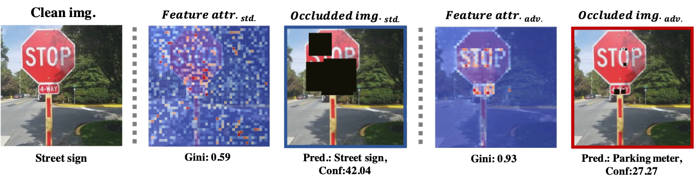
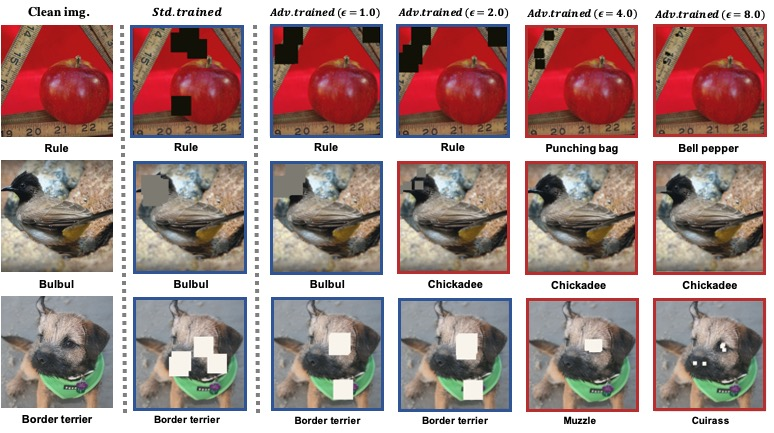
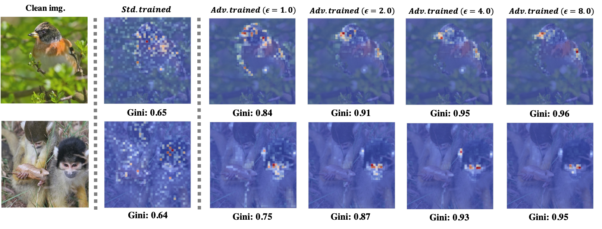

# Inequality phenomenon in $L_{\infty}$ adversarial training.

This repository contains the code and models necessary to replicate the results of our paper:

**Inequality phenomenon in $l_{\infty}$-adversarial training, and its unrealized threats (ICLR spotlight)**  
Paper: https://openreview.net/forum?id=4t9q35BxGr


_______
## Getting Started
*Our pretrained model relies on the work [Do Adversarially Robust ImageNet Models Transfer Better?](https://github.com/microsoft/robust-models-transfer)*
1. Clone our repo.
2. Install dependencies:  
```
conda create -n inequality_test python=3.8  
conda activate inequality_test 
pip install -r requirements.txt
```
3. Download pretrained model from the [link](https://github.com/microsoft/robust-models-transfer)

---------

## Running Experiments

#### 1. Evaluation inequality degree of pretrained model
```
python inequality_test.py
```
#### 2. Inductive noise attack
```
python noise_eval.py
```
#### 3. Inductive occludion attack
```
python occlusion_eval.py
```

#### 4. Run saliency examples
```
python saliency_example.py
```

*Please check the augments in each .py, change the attribution method in utils.py*

## Citation
```bibtex
@inproceedings{duaninequality,
  title={Inequality phenomenon in $ l\_ $\{$$\backslash$infty$\}$ $-adversarial training, and its unrealized threats},
  author={Duan, Ranjie and Chen, YueFeng and Zhu, Yao and Jia, Xiaojun and Zhang, Rong and others},
  booktitle={The Eleventh International Conference on Learning Representations}
}
```
If you have any further question, please contact ranjie.drj@alibaba-inc.com