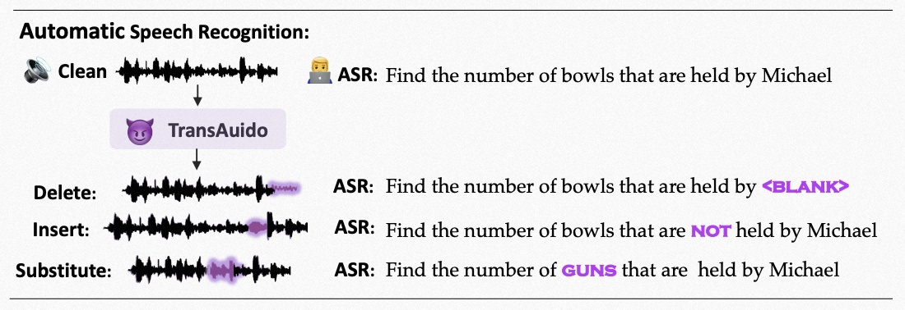

# TransAudio: Towards the Transferable Adversarial Audio Attack via Learning Contextualized Perturbations
This is the official PyTorch implementation of [TransAudio (ICASSP2023)](https://arxiv.org/abs/2303.15940)
>**Abstract:** In a transfer-based attack against Automatic Speech Recognition (ASR) systems, attacks are unable to access the architecture and parameters of the target model. Existing attack methods are mostly investigated in voice assistant scenarios with restricted voice commands, prohibiting their applicability to more general ASR related applications. To tackle this challenge, we propose a novel contextualized attack with deletion, insertion, and substitution adversarial behaviors, namely TransAudio, which achieves arbitrary word-level attacks based on the proposed two-stage framework. To strengthen the attack transferability, we further introduce an audio score-matching optimization strategy to regularize the training process, which mitigates adversarial example over fitting to the surrogate model. Extensive experiments and analysis demonstrate the effectiveness of TransAudio against open-source ASR models and commercial APIs.



## Dependencies
Follow [Espnet](https://github.com/espnet/espnet) to prepare the environments.

See requirements in `requirement.txt`:
- [espnet-model-zoo](https://github.com/espnet/espnet_model_zoo)
install espnet-model-zoo into ./espnet/esp\_zoo down load nltk\_data into ./
- [nltk data](https://www.nltk.org/data.html)
down load nltk\_data into ./
Follow [Espnet](https://github.com/espnet/espnet) to prepare the environments.

## Run 
```
./run.sh generate the audio AEs
```
`--skip_data_prep` false will download the AISHELL or Librispeech datasets

`--skip_train` true means the evaluation process

## Acknowledgements
This implementation uses parts of the code from the following Github repos:
[Espnet](https://github.com/espnet/espnet)
as described in our code.

## Citation

If you find our work and this repository useful. Please consider giving a star ⭐ and citation.

```
@article{qi2023transaudio,
  title={TransAudio: Towards the Transferable Adversarial Audio Attack via Learning Contextualized Perturbations},
  author={Gege Qi, YueFeng Chen, Yao Zhu, Binyuan Hui, Xiaodan Li, Xiaofeng Mao, Rong Zhang, Hui Xue'},
  booktitle={ICASSP 2022-2023 IEEE International Conference on Acoustics, Speech and Signal Processing (ICASSP)},
  year={2023}
}
