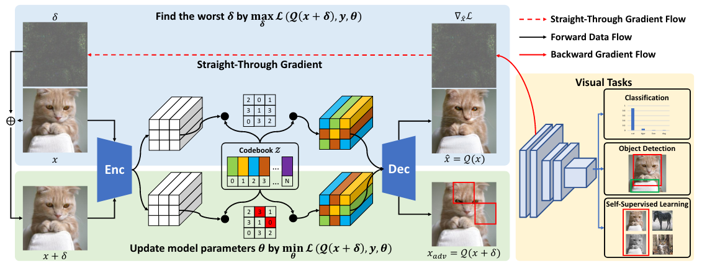

# Discrete Adversarial Training (NeurIPS'2022)



This is the official PyTorch implementation of "Enhance the Visual Representation via Discrete Adversarial Training", Xiaofeng Mao, Yuefeng Chen, Ranjie Duan, Shaokai Ye, Yao Zhu, Xiaodan Li, Gege Qi, Rong Zhang, Hui Xue.

Paper: http://arxiv.org/abs/2209.07735

>**Abstract:** Adversarial Training (AT), which is commonly accepted as one of the most effective approaches defending against adversarial examples, can largely harm the
standard performance, thus has limited usefulness on industrial-scale production
and applications. Surprisingly, this phenomenon is totally opposite in Natural
Language Processing (NLP) task, where AT can even benefit for generalization.
We notice the merit of AT in NLP tasks could derive from the discrete and symbolic input space. For borrowing the advantage from NLP-style AT, we propose
Discrete Adversarial Training (DAT). DAT leverages VQGAN to reform the image
data to discrete text-like inputs, i.e. visual words. Then it minimizes the maximal risk on such discrete images with symbolic adversarial perturbations. We
further give an explanation from the perspective of distribution to demonstrate
the effectiveness of DAT. As a plug-and-play technique for enhancing the visual
representation, DAT achieves significant improvement on multiple tasks including
image classification, object detection and self-supervised learning. Especially, the model pre-trained with Masked Auto-Encoding (MAE) and fine-tuned by our DAT
without extra data can get 31.40 mCE on ImageNet-C and 32.77% top-1 accuracy
on Stylized-ImageNet, building the new state-of-the-art.

## Requirements
Check [Installation](../../../README.md#installation) for preparing requirements.

## Training & Evaluation 

To train DAT models with single 8-GPU machine, run this command:

```bash
python -m torch.distributed.launch --nproc_per_node=8 examples/imageclassification/imagenet/dat/main.py \
--data_dir=$ImageNetDataDir \
--model=vit_base_patch16_224 \
--amp \
--epochs=300 \
--batch-size=128 \
--lr=0.001 \
--drop-path=0.25 \
--model-ema \
--model-ema-decay=0.99992 \
--opt=adamw \
--opt-eps=1e-8 \
--weight-decay=0.05 \
--sched=cosine \
--warmup-lr=1e-6 \
--warmup-epochs=5 \
--cooldown-epochs=10 \
--patience-epochs=10 \
--color-jitter=0.4 \
--aa=rand-m9-mstd0.5-inc1 \
--smoothing=0.1 \
--reprob=0.25 \
--mixup=0.8 \
--cutmix=1.0 \
--pin-mem \
--mean 0.0 0.0 0.0 \
--std 1.0 1.0 1.0 \
--output=output/dat \
--experiment=tmp
```

Run following command to evaluate DAT models:

```bash
# resnet
python benchmarks/benchmark.py --num-gpu 8 --batch-size 1024 --model resnet50 --interpolation 3 --ckpt_path http://alisec-competition.oss-cn-shanghai.aliyuncs.com/discrete_adversarial_training_models/resnet50_dat.pth

# vit-b/16
python benchmarks/benchmark.py --num-gpu 8 --batch-size 256 --model vit_base_patch16_224 --interpolation 3 --ckpt_path http://alisec-competition.oss-cn-shanghai.aliyuncs.com/discrete_adversarial_training_models/vit_dat.pth

# mae-vit-huge
python benchmarks/benchmark.py --num-gpu 8 --model mae_vit_huge_patch14 --interpolation 3 --ckpt_path http://alisec-competition.oss-cn-shanghai.aliyuncs.com/discrete_adversarial_training_models/mae_dat.pth
```

## Pretrained Weights

Official models in the paper:

| Model | ImageNet-Val | V2 | C (mCE↓) | R | A | Sketch| Stylized | Files |
| ---- | :----: | :----: | :----: | :----: | :----: | :----: | :----: | :----: |
| [ResNet50](https://arxiv.org/abs/1512.03385) | 76.52% | 65.02% | 74.16 | 41.90% | 4.38% | 27.27% | 10.8% |[ckpt](http://alisec-competition.oss-cn-shanghai.aliyuncs.com/discrete_adversarial_training_models/resnet50_dat.pth) |
| [ViT-B/16](https://arxiv.org/abs/2010.11929) | 81.46% | 70.83% | 44.65 | 47.34% | 30.15% | 34.77% | 23.13% |[ckpt](http://alisec-competition.oss-cn-shanghai.aliyuncs.com/discrete_adversarial_training_models/vit_dat.pth) |
| [MAE-ViT-H](https://arxiv.org/abs/2111.06377) | 87.02% | 78.82% | 31.40 | 65.61% | 68.92% | 50.03% | 32.77% |[ckpt](http://alisec-competition.oss-cn-shanghai.aliyuncs.com/discrete_adversarial_training_models/mae_dat.pth) |

Models trained by EasyRobust:

| Model | ImageNet-Val | V2 | C (mCE↓) | R | A | Sketch| Stylized | Files |
| ---- | :----: | :----: | :----: | :----: | :----: | :----: | :----: | :----: |
| [ViT-B/16](https://arxiv.org/abs/2010.11929) | 81.38% | 69.99% | 45.59 | 49.64% | 24.61% | 36.46% | 24.84% |[ckpt](http://alisec-competition.oss-cn-shanghai.aliyuncs.com/xiaofeng/easy_robust/benchmark_models/ours/examples/dat/model_best.pth.tar)/[args](http://alisec-competition.oss-cn-shanghai.aliyuncs.com/xiaofeng/easy_robust/benchmark_models/ours/examples/dat/args.yaml)/[logs](http://alisec-competition.oss-cn-shanghai.aliyuncs.com/xiaofeng/easy_robust/benchmark_models/ours/examples/dat/summary.csv) |

## Citation
If you find our work and this repository useful. Please consider giving a star ⭐ and citation. 

```
@article{mao2022enhance,
  title={Enhance the visual representation via discrete adversarial training},
  author={Mao, Xiaofeng and Chen, Yuefeng and Duan, Ranjie and Zhu, Yao and Qi, Gege and Ye, Shaokai and Li, Xiaodan and Zhang, Rong and Xue, Hui},
  journal={arXiv preprint arXiv:2209.07735},
  year={2022}
}
```
