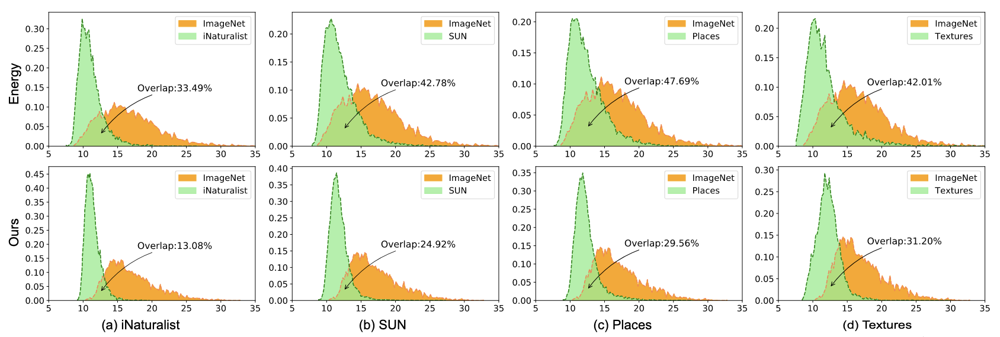

# Boosting OOD detection with typical features
This is the official PyTorch implementation of [Boosting Out-of-distribution Detection with Typical Features](https://arxiv.org/abs/2210.04200)

>**Abstract:** Out-of-distribution (OOD) detection is a critical task for ensuring the reliability and safety of deep neural networks in real-world scenarios.
Different from most previous OOD detection methods that focus on designing OOD scores or introducing diverse outlier examples to retrain the model, we delve into the obstacle factors in OOD detection from the perspective of typicality and regard the feature's high-probability region of the deep model as the feature's typical set.
We propose to rectify the feature into its typical set and calculate the OOD score with the typical features to achieve reliable uncertainty estimation.
The feature rectification can be conducted as a {plug-and-play} module with various OOD scores.
We evaluate the superiority of our method on both the commonly used benchmark (CIFAR) and the more challenging high-resolution benchmark with large label space (ImageNet). Notably, our approach outperforms state-of-the-art methods by up to 5.11% in the average FPR95 on the ImageNet benchmark 



*Our main idea is to reduce the influence of the extreme features and make prediction with typical features, which benefits the estimation of the reject region. In practice, we rectify the faetures into the high-density region to improve the OOD detection performance. As shown in this figure, our method can reduce the variance of the output of the existing OOD scores and reduce the overlap between ID and OOD examples.*

We choose 4 post-hoc OOD detection metrics including **MSP (ICLR 2017), ODIN (ICLR 2018), Energy (NIPS 2020), GradNorm (NIPS 2021)**. When using GradNorm, the batch should be set as 1. In the following, we provide demos for using typical features to improve the OOD detection performance.

## ImageNet 

### Dataset
Unzip and place the following datasets in the dir `ID_OOD_dataset`.

- Imagenet-1k:   https://image-net.org/challenges/LSVRC/2012/index

- iNaturalist:   http://pages.cs.wisc.edu/~huangrui/imagenet_ood_dataset/iNaturalist.tar.gz

- SUN:           http://pages.cs.wisc.edu/~huangrui/imagenet_ood_dataset/SUN.tar.gz

- Places:        http://pages.cs.wisc.edu/~huangrui/imagenet_ood_dataset/Places.tar.gz

- Textures:      https://www.robots.ox.ac.uk/~vgg/data/dtd/

### Usage
**Example 1:** Choosing ImageNet as in-distribution dataset and SUN as out-of-distribution dataset. Using the Energy Score as the metric:
```
./test.sh ImageNet Energy SUN 0
```

**Example 2:** Using our method to boost the performance of Energy: 

```
./test.sh ImageNet Energy SUN 1
```

When choosing SUN as the OOD dataset, rectifying the features can decrease the FPR95 of Energy Score from 40.81% to 29.19%.

**Example 3:** Choosing ImageNet as in-distribution dataset and SUN as out-of-distribution dataset. Using the GradNorm as the metric:
```
./test.sh ImageNet GradNorm SUN 0
```

**Example 4:** using our method to boost the performance of GradNorm: 

```
./test.sh ImageNet GradNorm SUN 1
```

When choosing SUN as the OOD dataset, rectifying the features can decrease the FPR95 of GradNorm from 40.81% to 29.19%.


## CIFAR

### Dataset

- DownLoad the dataset `ID_OOD_dataset.zip` from: https://drive.google.com/drive/folders/14quqbOBnXblRneTCdlECxkq13yMPWQ3D?usp=sharing. Unzip and place the datasets in the dir `./ID_OOD_dataset`.

- DownLoad the pre-trained `resnet_cifar10.pth` model from: https://drive.google.com/drive/folders/14quqbOBnXblRneTCdlECxkq13yMPWQ3D?usp=sharing. Place the model in the dir `./checkpoints`.

### Usage

**Example 1:** Choosing CIFAR10 as in-distribution dataset and SVHN as out-of-distribution dataset. Using the Energy Score as the metric:
```
./test.sh CIFAR Energy SVHN 0
```

**Example 2:** Using our method to boost the performance of Energy: 
```
./test.sh CIFAR Energy SVHN 1
```

When choosing SVHN as the OOD dataset, rectifying the features can decrease the FPR95 of Energy Score from 54.04% to 37.01%.

## Citation

If you find our work and this repository useful. Please consider giving a star ⭐ and citation.

```
@article{zhu2022boosting,
  title={Boosting Out-of-distribution Detection with Typical Features},
  author={Yao Zhu, YueFeng Chen, Chuanlong Xie, Xiaodan Li, Rong Zhang, Hui Xue', Xiang Tian, bolun zheng and Yaowu Chen},
  booktitle={Advances in Neural Information Processing Systems},
  year={2022}
}
```
