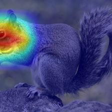
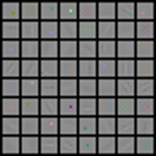
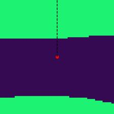
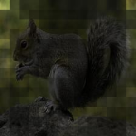

# Usage of Analytical Tools

## Attention Visualization of CNNs

```
Usage: 
    python cnn_attention.py [OPTIONS...]

OPTIONS:
    --model [ARCH in timm]
    --ckpt_path [URL or PATH of the model weights]
    --input_image [PATH or URL of the input image]
    --method [METHOD of CNN visualization]
```

- CNN Attention for Standard ResNet50:

```bash
python cnn_attention.py --model resnet50 --ckpt_path https://download.pytorch.org/models/resnet50-19c8e357.pth --input_image http://alisec-competition.oss-cn-shanghai.aliyuncs.com/xiaofeng/easy_robust/assets/test.png 
```


- CNN Attention for Robust ResNet50:

```bash
python cnn_attention.py --model resnet50 --ckpt_path http://alisec-competition.oss-cn-shanghai.aliyuncs.com/xiaofeng/imagenet_pretrained_models/advtrain_models/advtrain_resnet50_ep4.pth --input_image http://alisec-competition.oss-cn-shanghai.aliyuncs.com/xiaofeng/easy_robust/assets/test.png 
```



## Convolution Kernel Visualization

```
Usage: 
    python kernal_visualization.py [OPTIONS...]

OPTIONS:
    --model [ARCH in timm]
    --ckpt_path [URL or PATH of the model weights]
```

- Visualize the Filters of a Standard ResNet50::

```bash
python kernal_visualization.py --model resnet50 --ckpt_path https://download.pytorch.org/models/resnet50-19c8e357.pth
```


- Visualize the Filters of a Robust ResNet50::

```bash
python kernal_visualization.py --model resnet50 --ckpt_path http://alisec-competition.oss-cn-shanghai.aliyuncs.com/xiaofeng/imagenet_pretrained_models/advtrain_models/advtrain_resnet50_ep4.pth
```



## Visualization of Decision Boundary
```
Usage: 
    python decision_bound.py [OPTIONS...]

OPTIONS:
    --model [ARCH in timm]
    --ckpt_path [URL or PATH of the model weights]
    --input_image [URL or PATH of the input image]
```

- Visualize the Decision Boundary of a Standard ResNet50:

```bash
python decision_bound.py --model resnet50 --ckpt_path https://download.pytorch.org/models/resnet50-19c8e357.pth --input_image http://alisec-competition.oss-cn-shanghai.aliyuncs.com/xiaofeng/easy_robust/assets/test.png --max-eps 120 --eps-step 3
```


- Visualize the Decision Boundary of a Robust ResNet50:

```bash
python decision_bound.py --model resnet50 --ckpt_path http://alisec-competition.oss-cn-shanghai.aliyuncs.com/xiaofeng/imagenet_pretrained_models/advtrain_models/advtrain_resnet50_ep4.pth --input_image http://alisec-competition.oss-cn-shanghai.aliyuncs.com/xiaofeng/easy_robust/assets/test.png --max-eps 120 --eps-step 3
```


## Attention Visualization of ViTs

```
Usage: 
    python vit_attenton.py [OPTIONS...]

OPTIONS:
    --model [ARCH in timm]
    --ckpt_path [URL or PATH of the model weights]
    --input_image [PATH or URL of the input image]
```

- ViT Attention for Standard ViT-B/16:

```bash
python vit_attenton.py --model vit_base_patch16_224 --ckpt_path http://alisec-competition.oss-cn-shanghai.aliyuncs.com/xiaofeng/imagenet_pretrained_models/clean_models/timm_model/vit_base_patch16_224.pth --input_image http://alisec-competition.oss-cn-shanghai.aliyuncs.com/xiaofeng/easy_robust/assets/test.png 
```


- ViT Attention for Robust ViT-B/16:

```bash
python vit_attenton.py --model vit_base_patch16_224 --ckpt_path http://alisec-competition.oss-cn-shanghai.aliyuncs.com/xiaofeng/imagenet_pretrained_models/advtrain_models/advtrain_vit_base_patch16_224_ep4.pth --input_image http://alisec-competition.oss-cn-shanghai.aliyuncs.com/xiaofeng/easy_robust/assets/test.png 
```




## Shape vs. Texture Biases Analysis

Examples: 

```bash
python shape_texture_bias.py
```
then check `tools/modelvshuman/figures/example-figures/`.